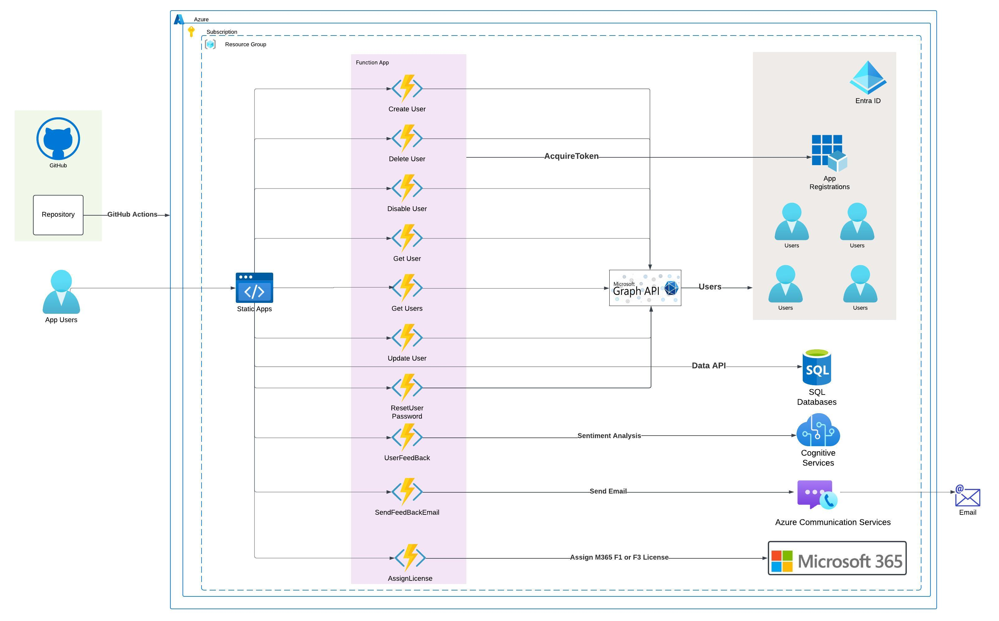

# Use Case

**Programming Parrot Corp** is going through an expansion phase. There are lot of users joining in different departments spread across different locations and also there are lot of seasonal wokers joining.
Programming Parrot Corp uses Entra ID for authentication and to provide access to various SAAS Applications . Now Once the User joins diffferent department managers raise requests for user accounts in Entra ID.
Entra ID admins is pretty swamped with requests and there is a backlog of requests to create user accounts which is causing delay  in user account creation or modification for exisitng users.
Programming Parrot Corp is looking for a Solution which can be rolled out to users acorss different locations where tasks can be performed in self serve mode.

Programming Parrot Corp also wants to rollout solution **faster , easy to maintain  and keep the solution cost low** .


# Solution - AzureUserEntraIDApp

**AzureUserEntraIDApp** is a Blazor WebAssembly application that provides functionalities for managing users in an **Azure environment**. The application allows users to **display, create, modify, disable, and delete user accounts** in **Entra ID** using **Graph API** . It also includes a feedback form for users to submit their feedback ,then do **Sentiment Analysis** using **Azure AI Language** and then save the feedback,sentiment,user email and phone number to **SQL Server Database** using **Data API**

**Azure Components used in this solution** - 
- **Azure Static Web Apps , Azure Functions , Entra ID , Azure AI Language , Micrsoft Graph API , SQL Server Database , Microsoft Data Builder API**

## Architecture overview



## Features

- **Display All Users**: View a list of all users.
- **Create User**: Add a new user to Azure Entra ID using Graph API  
- **Modify User**: Edit existing user in Azure Entra ID using Graph API
- **Disable User**: Disable a user account  in Azure Entra ID using Graph API
- **Delete User**: Remove a user account  in Azure Entra ID using Graph API
- **Reset User Password**: Reset password for user
- **Assign M365 License**: Assign M365 F1 /F3 Licence to the user
- **Feedback**: Submit feedback about the application.
- **Sentiment Analysis**: Sentiment Analysis of user sentiment using **Azure AI Language**.
- **SaveFeedback to SQL Server DB**: Save Feedback , user email and user phone number to MS SQL Server DB using **Data API** .
- **Send FeedBack Email**: Sending email to user with feedback and response based on sentiment analysis.  

## Getting Started

### Prerequisites

- [.NET 8 SDK](https://dotnet.microsoft.com/download/dotnet/8.0)
- [Visual Studio 2022](https://visualstudio.microsoft.com/vs/) or later
- [Node.js](https://nodejs.org/) (for building and running the application)

## Project Structure

- **AzureUserEntraIDApp**: The main Blazor WebAssembly project.
  - **Pages**: Contains the Razor components for different pages.
    - `Home.razor`: Home page component.
    - `CreateUser.razor`: Component for creating a new user.
    - `UserList.razor`: Component for displaying and managing the user list.
    - `Feedback.razor`: Component for submitting feedback , doing **sentiment Analysis** using **Azure AI Language** and saving to **SQL Database** using **Data API**.
    - `AboutUs.razor`: Component for displaying information about the team.
    - `EditUser.razor`: Component for modifying exisitng user.
    - `DisableUser.razor`: Component for Disabling existing account.
    - `DeleteUser.razor`: Component for deleting a user account.
    - `ResetUserPassword.razor`: Component for resetting password for user account.
    - `AssignLicense.razor`: Assign M365 License to the user.
          
  - **Shared**: Contains shared components and layouts.
    - `MainLayout.razor`: Main layout component.
    - `NavMenu.razor`: Navigation menu component.
      
  - **wwwroot**: Contains static files such as CSS, JavaScript, and images.
    - `index.html`: The main HTML file for the Blazor WebAssembly application.
    - `logo.png`: The logo image used as the favicon
      
- **BlazorApp.NUnitTests**: Contains the unit tests for the application.
    - `FeedbackTests.cs`: Unit tests for the `Feedback.razor` component.
    - `DisableUserTests.cs`: Unit tests for the `DisableUser.razor` component.
    - `DeleteUserTests.cs`: Unit tests for the `DeleteUser.razor` component.
    - `CreateUserTests.cs`: Unit tests for the `CreateUser.razor` component.
    - `EditUserTests.cs`: Unit tests for the `EditUser.razor` component.
    - `HomeTests.cs`: Unit tests for the `Home.razor` component.
    - `ResetUserPasswordTests.cs`: Unit tests for the `ResetUserPassword.razor` component.
    - `AssignLicenseTests.cs`: Unit tests for the `AssignLicense.razor` component.

 
- **API Project**: The API project is an Azure Functions project targeting .NET 8. It includes various functions for handling user-related operations and feedback processing. The project leverages Microsoft Graph API for user management and integrates with Azure for authentication and authorization.
### Functions
- **CreateUserFunction.cs**: Handles the creation of new users.
- **UpdateUserFunction.cs**: Handles the updating of existing user information.
- **DisableUserFunction.cs**: Handles disabling user accounts.
- **GetUserFunction.cs**: Retrieves user information.
- **GetUsersFunction.cs**: Retrieves a list of users.
- **DeleteUserFunction.cs**: Handles the deletion of user accounts.
- **UserFeedbackFunction.cs**: Processes user feedback and performs sentiment analysis.
- **AssignLicenseFunction.cs**: Assign M365 License F1 or F3 to the user.
- **SendFeedbackEmailFunction.cs**: Sends feedback entered by user and feedback response based on sentiment analysis.

### Models
- **NewUser.cs**: Represents the data model for a new user.
- **UserFeedback.cs**: Represents the data model for user feedback.

### Properties
- **launchSettings.json**: Contains settings for launching the project locally.

### Configuration Files
- **local.settings.json**: Contains local settings for the Azure Functions project.
- **host.json**: Contains global configuration options for all functions in the project.

### Project File
- **Api.csproj**: The project file that defines the dependencies and build settings for the API project.

### Installation

1. **Clone the repository**:
   
   git clone https://github.com/shreyasrastogi/AzureUserEntraIDApp.git
   
   cd AzureUserEntraIDApp

# Local Development Setup

## Overview
To run the Azure Functions project locally, you need to create a `local.settings.json` file in the root directory of the project. This file contains configuration settings and secrets required for local development.

## Steps to Create `local.settings.json`

### 1. Create the File
In the root directory of your Azure Functions project, create a file named `local.settings.json`.

### 2. Add Configuration Settings
Open the `local.settings.json` file and add the necessary configuration settings. Below is an example configuration for an Azure Functions project that includes settings for Azure Storage, Azure AD authentication, and a sentiment analysis API.

 ### local.settings.json
 
 ```
{
    "IsEncrypted": false,
    "Values": {
        "AzureWebJobsStorage": "UseDevelopmentStorage=true",
        "FUNCTIONS_WORKER_RUNTIME": "dotnet-isolated",
        "ClientId": "your-client-id",
        "TenantId": "your-tenant-id",
        "ClientSecret": "your-client-secret",
        "SentimentAnalysisApiKey": "your-sentiment-analysis-api-key",
        "SentimentAnalysisEndpoint": "https://your-sentiment-analysis-endpoint.cognitiveservices.azure.com/"
    },
    "Host": {
        "CORS": "*",
        "CORSCredentials": false
    }
}

```

### Configuration Settings Explained
- **IsEncrypted**: Indicates whether the settings are encrypted. Set to `false` for local development.
- **Values**: Contains key-value pairs for various configuration settings.
  - **AzureWebJobsStorage**: Connection string for Azure Storage. Use `UseDevelopmentStorage=true` for local development.
  - **FUNCTIONS_WORKER_RUNTIME**: Specifies the runtime for Azure Functions. Set to `dotnet-isolated` for .NET isolated process.
  - **ClientId**: The client ID of your Azure Entra ID application.
  - **TenantId**: The tenant ID of your Azure Entra ID.
  - **ClientSecret**: The client secret of your Azure Entra ID application.
  - **SentimentAnalysisApiKey**: The API key for the sentiment analysis service.
  - **SentimentAnalysisEndpoint**: The endpoint URL for the sentiment analysis service.
- **Host**: Contains settings for the local host.
  - **CORS**: Specifies allowed origins for CORS. Use `*` to allow all origins.
  - **CORSCredentials**: Indicates whether credentials are supported for CORS. Set to `false` for local development.

## Adding `local.settings.json` to `.gitignore`
To ensure that sensitive information in `local.settings.json` is not committed to source control, add the following line to your `.gitignore` file:

## Running the Project Locally

### Prerequisites
- .NET 8 SDK
- Azure Functions Core Tools
- Visual Studio 2022 or later


**Registering an Application in Microsoft Entra ID**

To register an application in Microsoft Entra ID, follow these steps:
- Navigate to the Azure Portal.
- Navigate to Microsoft Entra ID
- Navigate to App Registrations
- Click on the **"New registration"** button at the top of the App registrations pane.
- Enter a name for your application (e.g., "AzureUserEntraIDApp").
-	Supported account types: Choose who can use the application:
- Click the **"Register"** button to create the application.
Step 4: Configure the Application
- After registration, you will be taken to the application's overview page. Here, you can find the **Application (client) ID and Directory (tenant) ID**, which you will need for your application configuration.
- **Certificates & Secrets:**
•	Click on "New client secret" to generate a new client secret. Provide a description and set an expiration period.
•	Value: Copy the client secret value and store it securely. You will need this value for your application configuration.
- **API Permissions:**
•	Click on "Add a permission" and Graph API Permissions ( User.Read and  User.ReadWrite.All) & Grant admin consent
- Configure Your API Project by updating local.settings.json

**Creating an Azure Sentiment Analysis Endpoint**
To create an Azure Sentiment Analysis endpoint using Azure AI Services (Language services), follow these steps:
- Navigate to the Azure Portal.
- Create a Cognitive Services Resource
- In the search bar, type "Language" and select "Language" from the list.
- Click on the "Create" button. 
- Fill in the Resource Details:.
- Review your settings and click "Create".
- Configure the Sentiment Analysis Endpoint
- In the left-hand menu, click on "Keys and Endpoint".
  - **Endpoint**: Copy the endpoint URL. This will be used in your application.
  - **Keys**: Copy one of the keys. This will be used as the API key in your application.
- Update Your Application Configuration in API Project  in local.settings.json:

**Creating a SQL Server Database in Azure**
- Sign in to Azure Portal: Navigate to the Azure Portal and sign in.
- Create SQL Server: Create a new SQL Server in Azure.
- Create SQL Database: Create a new SQL Database in the SQL Server.
- Configure Firewall Rules: Set up firewall rules to allow access to the SQL Server.
- Connect to SQL Database: Get the connection string .

**Create the SQL Server Table**
 ```
CREATE TABLE dbo.UserFeedback (
    Id INT IDENTITY(1,1) PRIMARY KEY,
    Text NVARCHAR(MAX) NOT NULL,
    Email NVARCHAR(255) NOT NULL,
    PhoneNumber NVARCHAR(50) NOT NULL,
    Sentiment NVARCHAR(50) NOT NULL
);

 ```
**Setup Data Builder API**  
**( not required as already setup , below are the steps that were followed for informational purpose)**
- Use the swa db init command to generate a database configuration file.

  ```
  swa db init --database-type mssql
  ```
  
- Use the dab add command to add at least one database entity to the configuration.

  ```
  dab add "UserFeedback" --source "dbo.UserFeedback" --permissions "anonymous:*" --config "swa-db-connections/staticwebapp.database.config.json"
   ```

- Create the env variable for connection string and initialize connection string in previous step.

  **Creating a Azure communication services resource**
-  Navigate to the Azure Portal.
-  Create a Cognitive Services Resource
-  Search "Communication services"
-  Click on "create" and then fill out the details
-  Once the resource is created , navigate -> email -> Try Email
-  Go to "Send Email From" Dropdown then select "setup a Free Azure Doamin" then fill out the details.
-  Once setup is done "Send Email from" will be populated , try to send a test mail.
-  Go to Settings->Keys-> Copy Connection String

  **Getting M365 License to assign to user**
-  Navigate to the Azure Portal.
-  Search "Licenses"
-  Click on "Go to M365 Admin Center"
-  Navigate to Billing-> Your Products -> Add more Products
-  Click on "All Products" and search F1 and then add Microsoft 365 F1 (Month to Month)
-  User can enable trial for 25 Licenses
-  Perform similar step for Microsoft 365 F3 amd enable trial if required 
-  Once done you can assign Licenses using the Application once deployed.
  


### Steps
1. **Open the Solution**:
   Open the solution in Visual Studio.

2. **Restore NuGet Packages/dependencies**:
   Restore the NuGet packages by running the following command in the terminal: **dotnet restore**

3. **Build the Solution**:
   Build the solution by running the following command in the terminal: **dotnet build**
   
4. **Run the Functions Locally**:
   Set the API project as the startup project and run it using Visual Studio or the .NET CLI:
   
5. **Run the application**:  Run the Application **dotnet run**
   
### Running Tests
To run the unit tests, use the following command:**dotnet test**

**Pushing Code to GitHub**
- Go to GitHub and sign in with your GitHub account.
- Click on the "+" icon in the top right corner and select "New repository".
- Provide a name for your repository (e.g., AzureUserEntraIDApp).
- Choose the visibility (public or private) and click "Create repository".
- Push Your Project to GitHub:
- Open your terminal or command prompt , Navigate to the root directory of your project.
- Initialize a new Git repository:    **git init**
- Add all files to the repository:    **git add .**
- Commit the changes:                 **git commit -m "Initial commit"**
- Add the remote repository:          **git remote add origin https://github.com/yourusername/AzureUserEntraIDApp.git**
- Push the changes to GitHub:         **git push -u origin main**
- 

**Deploying your Project to Azure**

- **Application Registration , Sentiment Analysis Endpoint & Key , Azure SQL Server Database has been done in earlier , Please refer to the steps in local setup**

- Navigate to the Azure Portal.
**New Static Web App**
- Search for "Static Web App" and select **"Static Web App"**.
- Click "Create" and fill in the required details:
- Subscription: Select your Azure subscription.
- Resource Group: Create a new resource group or select an existing one.
- Name: Provide a name for your Static Web App.
- Region: Select a region.
- **Deployment Details**: Choose "GitHub" as the deployment source and authenticate with your GitHub account.
- **Repository**: Select your GitHub repository and branch.
- Build Details:
- **App location**: ./AzureUserEntraIDApp
- **Api location**: ./Api
- **Output location**: wwwroot
- Review your settings and click **"Create"**.

**Configure the Static Web App**

**1.Add Database connection(preview)**
Use the following steps to create a connection between the Static Web Apps instance of your site and your database.

- In the Settings section, select Database connection.
- Under the Production section, select the Link existing database link.
- In the Link existing database window, enter the following values:
- Database Type	Select your database type from the dropdown list.
- **Subscription**	Select your Azure subscription from the dropdown list.
- **Resource Group**	Select or create a resource group for your database.
- **Resource Name**	Select the database server name that has your desired database.
- **Database Name**	Select the name of the database you want to link to your static web app.
- **Authentication** Type	Select **Connection string**, and enter the Azure SQL user name and password.
 - Select OK.

   **2.Add Environment Variables**
   -
   - **ClientId**         -  Refer to Application Registration step above for details on how to get this value
   - **ClientSecret**     -  Refer to Application Registration step above for details on how to get this value  
   - **TenantId**         -  Refer to Application Registration step above for details on how to get this value
   - **SentimentAnalysisEndpoint**  - Refer to  Sentiment Ananlysis API Endpoint Setup step for this url
   - **SentimentAnalysisApiKey**    - Refer to  Sentiment Ananlysis API Endpoint Setup step for this key
   - **DATABASECONNECTIONSTRING**   - Refer to SQL Database to obtain the connection string
   - **AzureCommunicationServicesConnectionString** - Refer to Azure Communication service step to obtain the connection string 
  
   **3. Add a custom Domain (Optional)**
   - Click on "Custom Domains"
   - Click on "Add" , then click "New custom Domain"
   - Check if your domain is available or select appropriate domain
   - for this project we have taken **"programmingparrotcorp.com"**
   - Once the domain is setup , you can browser the site at **"programmingparrotcorp.com"**
  
   **4.Enable Enterpise Grade Edge**
   - Click on "Enterprise Grade Edge" enable Enterprise Grade Edge" by clicking on checkbox.
  


  **Enable Unit Test cases to run after deployment to Azure Static Web App to identify an post deployment issues**
  - Navigate to AzureUserEntraIDApp\.github\workflows
  - Open file **azure-static-web-apps-zealous-sea-0de5bb010.yml** 
  - Add **run_tests_job:** section to run test cases post deployment
  - Refer to AzureUserEntraIDApp\.github\workflows\azure-static-web-apps-zealous-sea-0de5bb010.yml for full details
  - Add Secrets
  - Navigate to Github->settings ->Secrets and Variables->Actions
  - Click on **New Repository secret**
  - **AZURE_STATIC_WEB_APPS_API_TOKEN_ZEALOUS_SEA_0DE5BB010** - it equal to deployment key in static web apps ( This sceret should  already be created during azure static web app setup setup )
  - **AZURE_WEBAPP_URL** - https://programmingparrotcorp.com/


### Update Favicon

To update the favicon, replace the `logo.png` file in the `wwwroot` directory and update the `index.html` file to reference the new favicon.

## Contributing

Contributtors to this current project are Shreyas Rastogi & Urvashi Mehta

## License

NA

## Contact

For any questions or feedback, please reach out to [shreyasrastogi@gmail.com](mailto:shreyasrastogi@gmail.com) , [mehtaurvashi123@gmail.com](mailto:mehtaurvashi123@gmail.com) .

### Reference 
- https://learn.microsoft.com/en-us/azure/static-web-apps/overview
- https://learn.microsoft.com/en-us/azure/data-api-builder/deployment/how-to-host-static-web-apps
- https://learn.microsoft.com/en-us/azure/static-web-apps/database-azure-sql?tabs=bash&pivots=static-web-apps-rest
- https://learn.microsoft.com/en-us/azure/static-web-apps/enterprise-edge?tabs=azure-portal
- https://learn.microsoft.com/en-us/azure/ai-services/language-service/sentiment-opinion-mining/quickstart?tabs=windows&pivots=programming-language-csharp
- https://learn.microsoft.com/en-us/azure/static-web-apps/apis-functions
- https://learn.microsoft.com/en-us/azure/data-api-builder/
- https://learn.microsoft.com/en-us/azure/communication-services/overview
